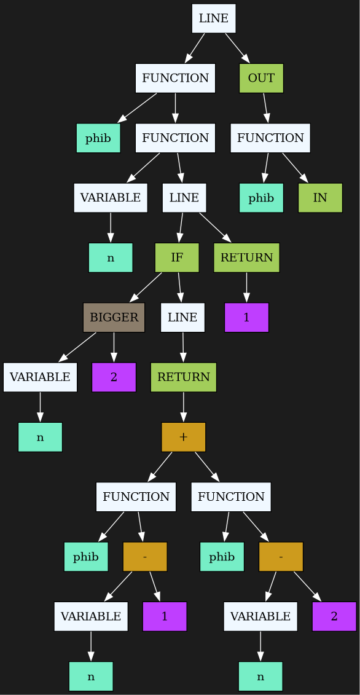

# Ultimate Programming Language
С-подобный язык программирования

## Требования

- GCC версии 15.2.1 и выше
- GNU make версии 4.4.1 и выше
- dot grapwiz версии 14.0.5 и выше


## Использование

```bash
make run
make bin
```

## Описание

Проект состоит из **frontend**, **middlend** и **backend**.

На этапе **frontend** программа использует **рекурсивный спуск** чтобы преобразовать программу пользователя в структуру дерева. На этом этапе улавливается большая часть ошибок.

На этапе **middlend** программа оптимизирует полученное ранее дерево, выполняя, например **свертку констант** и **dead code ellimination**.

Пример программы и ее дерева после оптимизации:

```
phib(n)
{
    if(n > 2)
    {
        return(phib(n - 1) + phib(n - 2));
    };

    return 1;
};

out(phib(in));
```



Далее дерево передается в **backend**, где переводится в ассемблерный/бинарный код для **x86-64**